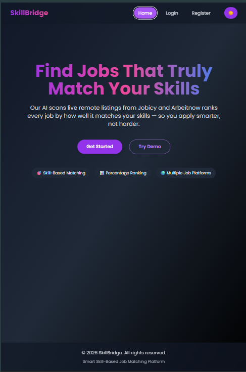
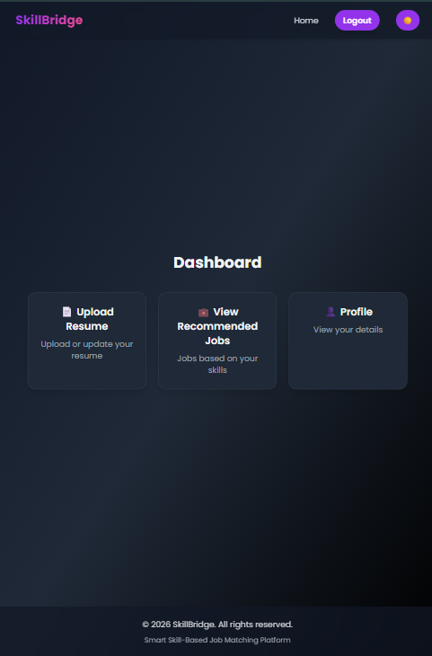
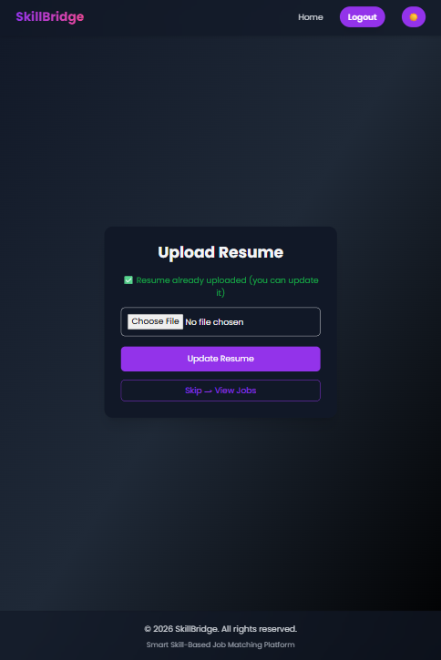
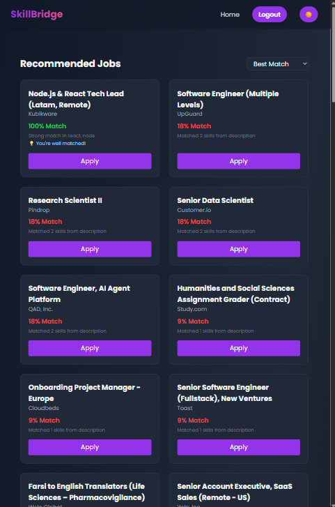
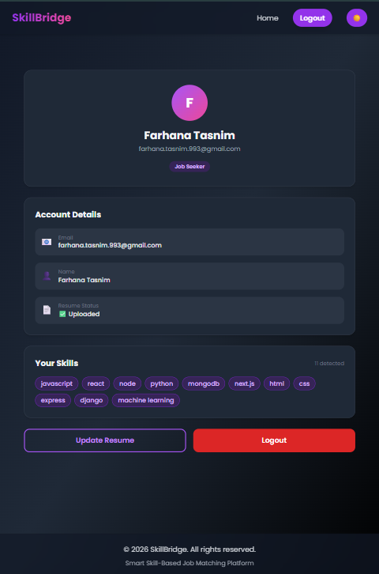

#  SkillBridge

**AI-powered Skill Match & Gap Analyzer**

SkillBridge parses your resume, extracts your skills, and matches you against live remote job listings — showing exactly how well you fit each role and what to learn next to close the gap.

🔗 **Live Demo:** [skillbridge-frontend-psi.vercel.app](https://skillbridge-frontend-psi.vercel.app)

---

## 📸 Screenshots

<table>
  <tr>
    <td align="center" width="50%">
      <br/>
      <sub>Home</sub>
    </td>
    <td align="center" width="50%">
      <br/>
      <sub>Dashboard</sub>
    </td>
  </tr>
  <tr>
    <td align="center" width="50%">
      <br/>
      <sub>Resume Upload</sub>
    </td>
    <td align="center" width="50%">
      <br/>
      <sub>Job Matches</sub>
    </td>
  </tr>
  <tr>
    <td align="center" colspan="2">
      <br/>
      <sub>Profile</sub>
    </td>
  </tr>
</table>

---

## ✨ Features

- **📄 Resume Parsing** — Upload a PDF resume; text is extracted server-side with `pdf.js` and scanned against a curated skills database. Uploads are validated on both MIME type and file extension (protects against spoofed content-types), capped at 5MB, and PDF-only.
- **💼 Live Job Aggregation** — Pulls real remote listings from the Jobicy API, with an automatic fallback to Arbeitnow if the primary source is unavailable.
- **⚡ Response Caching** — Raw job listings (shared across all users) are cached in-memory for 5 minutes, so repeat requests skip the round-trip to Jobicy/Arbeitnow entirely. Per-user match scoring still runs fresh on every request against the cached listings. See [Performance](#-performance) below for measured impact.
- **📊 Weighted, Word-Boundary-Aware Match Scoring** — Jobs aren't just keyword-matched; each skill is weighted by market relevance (e.g. core languages score higher than peripheral tools), and related skills are auto-expanded (e.g. knowing "React" implies partial credit for "MERN" stack roles). Skill detection uses word-boundary matching so substrings like "java" no longer false-match inside "javascript."
- **⚠️ Skill Gap Analysis** — Every job card highlights the top missing skills and a plain-language suggestion for what to learn next.
- **🧭 Guided Dashboard Flow** — Users are nudged to upload a resume before browsing jobs, with sensible redirects if no skills are on file.
- **👤 Profile Overview** — At-a-glance summary of account details, resume status, and detected skills.
- **🌙 Dark Mode** — Persisted theme preference with smooth transitions across the app.
- **🔒 Protected Routes & Auth** — Dashboard, resume, jobs, and profile pages require an authenticated session. Passwords are hashed with bcrypt; JWTs are signed server-side and verified on every protected request, with clean 401 handling (expired/invalid tokens, deleted users) instead of raw errors.
- **📈 Measured, Not Guessed** — Includes standalone scripts to benchmark real API latency and evaluate real matching accuracy against a hand-labeled test set, instead of relying on gut-feel claims. See [Performance](#-performance) below.

---

## 🛠 Tech Stack

**Frontend**
- React 18 + Vite 7
- React Router 7
- Tailwind CSS 3
- Framer Motion (animations)
- Axios

**Backend**
- Node.js + Express
- MongoDB + Mongoose
- Multer (in-memory file uploads, with MIME + extension validation)
- `pdfjs-dist` (PDF text extraction)
- Axios (external job API integration, with in-memory response caching)
- bcryptjs + jsonwebtoken (auth)

**External APIs**
- [Jobicy](https://jobicy.com/) — primary remote job source
- [Arbeitnow](https://www.arbeitnow.com/) — fallback job source

**Testing / Tooling**
- `scripts/benchmark.cjs` — gentle, single-user API latency benchmark (before/after comparison)
- `matchingAcc/matching-eval.cjs` — accuracy/precision/recall evaluation of the live matching algorithm against a hand-labeled test set

---

## 📁 Project Structure

```
skillbridge/
├── skillbridge-backend/
│   ├── config/
│   │   └── db.js                 # MongoDB connection
│   ├── controllers/
│   │   ├── authController.js     # Login / register handlers
│   │   ├── jobController.js      # Job fetching, caching + match scoring
│   │   └── resumeController.js   # PDF parsing + skill detection
│   ├── middleware/
│   │   ├── authMiddleware.js
│   │   └── upload.js             # Multer config + file-type validation
│   ├── models/
│   │   └── User.js
│   ├── routes/
│   │   ├── authRoutes.js
│   │   ├── jobRoutes.js
│   │   └── resumeRoutes.js
│   ├── utils/
│   │   ├── skills.js              # Skill DB, normalization, weighted matching, gap analysis
│   │   └── keepAlive.js          # Prevents free-tier hosting from sleeping
│   ├── scripts/
│   │   └── benchmark.cjs         # Latency benchmark (single-user, before/after)
│   ├── matchingAcc/
│   │   └── matching-eval.cjs     # Matching accuracy evaluation against labeled data
│   └── server.js
│
└── skillbridge-frontend/
    └── skillbridge-frontend/
        ├── src/
        │   ├── components/
        │   │   ├── layout/        # Navbar, Footer, Hero, Layout, JobCard
        │   │   └── ProtectedRoute.jsx
        │   ├── context/
        │   │   └── AuthContext.jsx # Centralized auth/skills state
        │   ├── pages/
        │   │   ├── Home.jsx
        │   │   ├── Login.jsx
        │   │   ├── Register.jsx
        │   │   ├── Dashboard.jsx
        │   │   ├── Resume.jsx
        │   │   ├── Jobs.jsx
        │   │   └── Profile.jsx
        │   ├── config.js          # API base URL
        │   └── App.jsx
        └── vite.config.js
```

---

## 🚀 Getting Started

### Prerequisites
- Node.js 18+
- A MongoDB connection string (local or Atlas)

### 1. Clone the repository
```bash
git clone https://github.com/FarhanaaTasnim/skillbridge.git
cd skillbridge
```

### 2. Backend setup
```bash
cd skillbridge-backend
npm install
```

Create a `.env` file in `skillbridge-backend/`:
```env
PORT=5000
MONGO_URI=your_mongodb_connection_string
JWT_SECRET=replace-with-a-long-random-string
JWT_EXPIRES_IN=7d
```

Run the server:
```bash
npm run dev
```

### 3. Frontend setup
```bash
cd skillbridge-frontend/skillbridge-frontend
npm install
```

Create a `.env` file with your backend URL:
```env
VITE_API_URL=http://localhost:5000
```

Run the frontend:
```bash
npm run dev
```

The app will be available at `http://localhost:5173`.

---

## 🔌 API Overview

| Method | Endpoint              | Description                                  |
|--------|------------------------|-----------------------------------------------|
| POST   | `/api/auth/register`  | Register a new user                          |
| POST   | `/api/auth/login`     | Authenticate a user                          |
| POST   | `/api/resume/upload`  | Upload a resume PDF and extract skills       |
| POST   | `/api/jobs/remote`    | Fetch remote jobs matched against skills (cached raw listings, per-user scoring) |

---

## 🧠 How the Matching Works

1. **Extraction** — Resume text is lowercased and checked against a known skills list using word-boundary-aware matching, so "java" no longer false-matches inside "javascript."
2. **Expansion** — Skills are expanded into related groups (e.g. `react` also implies partial `frontend`/`mern` relevance).
3. **Weighting** — Each job's required tags are weighted (core languages > frameworks > supporting tools).
4. **Scoring** — A percentage match score is calculated from weighted overlap, with a text-based fallback when a job has no structured tags.
5. **Gap Reporting** — Missing high-weight skills are surfaced with a short, actionable suggestion.

---

## 📈 Performance

These numbers come from the scripts in the repo, not estimates — run them yourself with `node scripts/benchmark.cjs before|after` and `node matchingAcc/matching-eval.cjs <test-file>`.

### API Latency (response caching)

`scripts/benchmark.cjs` sends 10 sequential single-user requests to `/api/jobs/remote` (1.5s apart, to avoid tripping Jobicy/Arbeitnow rate limits) and compares response times before and after adding the in-memory raw-job cache.

Because the "before" and "after" cache-miss requests hit third-party APIs with variable real-world latency, **median (p50)** is the more stable comparison than raw average — a single slow upstream response can swing the average by dozens of percentage points without reflecting the actual caching benefit. Across 4 separate runs:

| Run | Before avg | After avg | Before p50 | After p50 | p50 improvement |
|-----|-----------|-----------|------------|-----------|------------------|
| 1   | 197.7ms   | 115.8ms   | 158ms      | 75ms      | 52.5%            |
| 2   | 491.8ms   | 110.5ms   | 472ms      | 73ms      | 84.5%            |
| 3   | 339.7ms   | 248.9ms   | 284ms      | 64ms      | 77.5%            |
| 4   | 230.1ms   | 239.9ms   | 184ms      | 77ms      | 58.2%            |

**Takeaway:** cached response times are consistently tight (64–77ms across all 4 runs), while pre-cache times vary widely (158–472ms) depending on upstream API conditions. Median response time dropped **52–85%** after caching, with cache hits eliminating the need to re-query third-party job APIs on every request.

### Matching Accuracy

`matchingAcc/matching-eval.cjs` evaluates the live algorithm's real `matchScore` output (captured from actual app responses) against hand-labeled ground truth (`humanJudgment: "good" | "bad"` per job/resume pair), reporting accuracy, precision, recall, and F1 at a configurable threshold (`algorithmScore >= 50`).

Test set: 62 real job/resume pairs, built from 3 tailored versions of the same resume run against actual production output (BI analyst, data scientist, data engineer, and ML engineering manager roles) — not synthetic data. Every ambiguous label was checked against the real job description before being finalized.

| Metric    | Result | What it means |
|-----------|--------|----------------|
| Accuracy  | 83.9%  | Overall agreement between algorithm and human judgment across all 62 cases |
| Precision | 66.7%  | Of jobs the algorithm called "good," how many really were |
| Recall    | 18.2%  | Of jobs that really were "good," how many the algorithm caught |
| F1 score  | 28.6%  | Harmonic mean of precision and recall |

**Confusion matrix:** 2 true positives, 1 false positive, 50 true negatives, 9 false negatives.

**Known limitation (identified via this eval, not yet fixed):** the 9 false negatives are concentrated almost entirely in general senior-level engineering titles — Senior Software Engineer, Staff Engineer, Principal Engineer — which were consistently under-scored (0–33%) across all 3 resume versions. This happens because Jobicy frequently doesn't supply structured `jobTags` for these postings, forcing the algorithm's text-based fallback, which under-credits genuinely strong fits when a posting's title/description doesn't closely echo the resume's exact keyword phrasing. The high accuracy is driven mainly by a large number of true negatives (correctly-rejected bad fits); recall on true positives is the algorithm's clearest weak spot, and the next concrete improvement target — likely via better fallback matching or supplementing missing tags from the job title/description more aggressively.

---

## 🗺 Roadmap

- Persist real user accounts and hashed credentials ✅ *(done — bcrypt + JWT)*
- Move MongoDB credentials to environment variables in all environments ✅ *(done)*
- Expand the skills taxonomy and support fuzzy/synonym matching
- Improve recall on senior engineering titles (Senior/Staff/Principal Engineer) when a job posting has no structured tags — identified as the algorithm's main weak spot via `matching-eval.cjs` (see [Performance](#-performance))
- Add saved jobs and application tracking
- Persist the raw-job cache (currently in-memory, resets on server restart) to a shared store if scaling beyond a single instance

---

## 🤝 Contributing

Contributions, issues, and feature requests are welcome. Feel free to check the [issues page](https://github.com/FarhanaaTasnim/skillbridge/issues).

---

## ⭐ Support

If SkillBridge helped you, consider giving the repo a star — it helps others find the project!
